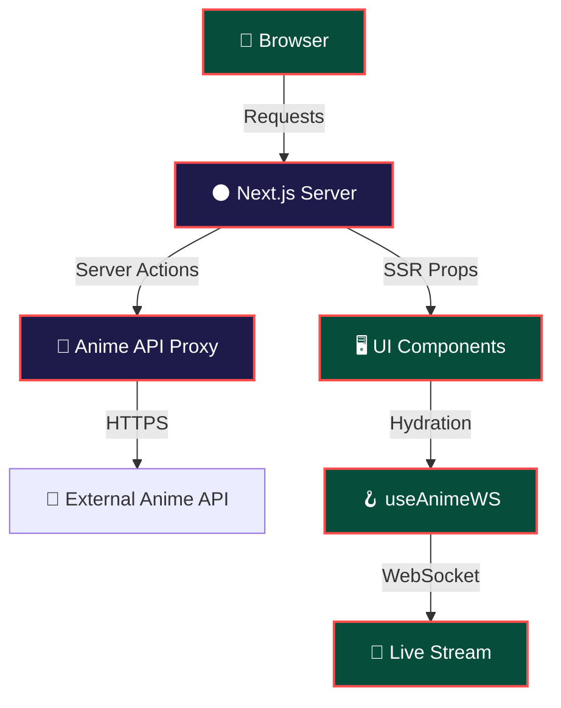

<div align="center">

<!-- ═══════════════════════════════════════════════════════════════ -->
<!--                        HERO BANNER                            -->
<!-- ═══════════════════════════════════════════════════════════════ -->


<br/>

<a href="https://anime-grid-demo.vercel.app">
  
</a>

<br/><br/>

<!-- Typing SVG -->


<br/><br/>

<!-- Badge Row 1 — Tech -->


<br/>

<!-- Badge Row 2 — Status -->


<br/><br/>

<p><i>"A visually stunning, fast, and fully responsive anime discovery grid – built for binge‑watchers and collectors alike."</i></p>

<a href="https://anime-grid-demo.vercel.app">
  
</a>
&nbsp;
<a href="#10--getting-started">
  
</a>
&nbsp;
<a href="#12--contributing">
  
</a>

</div>

---

<!-- ═══════════════════════════════════════════════════════════════ -->
<!--                    TABLE OF CONTENTS                          -->
<!-- ═══════════════════════════════════════════════════════════════ -->

## 📋 Table of Contents

1. [✨ Key Features](#1--key-features)  
2. [🏗️ Architecture Overview](#2--architecture-overview)  
3. [🛠️ Tech Stack](#3--tech-stack)  
4. [📸 Screenshots](#4--screenshots)  
5. [⚡ Performance](#5--performance)  
6. [🗺️ Roadmap](#6--roadmap)  
7. [🔐 Security Model](#7--security-model)  
8. [🧪 Testing](#8--testing)  
9. [📦 Getting Started](#9--getting-started)  
10. [🚀 Deployment](#10--deployment)  
11. [❓ FAQ](#11--faq)  
12. [🤝 Contributing](#12--contributing)  
13. [📄 Changelog](#13--changelog)  
14. [📜 License](#14--license)  
15. [👤 Author](#15--author)  
16. [⭐ Show Your Support](#16--show-your-support)

---

## 1️⃣ ✨ Key Features

| 🎯 | Feature | Description |
|:---|:---|:---|
| 🎨 | **Neon Dark Theme** | Glass‑morphism UI with cyan‑purple neon accents – easy on the eyes. |
| 📱 | **Responsive Masonry Grid** | Works from 320 px phones to 4K monitors, no horizontal scroll. |
| 🔍 | **Live Search + Filters** | Instant fuzzy search on title, genre, status, rating. |
| 📡 | **WebSocket Streaming** | Real‑time updates when new anime are added to the source API. |
| 🔄 | **Infinite Scroll + Pagination** | Lazy‑load thousands of entries without performance loss. |
| 📦 | **Server‑Side Data Fetching** | Next.js Server Actions keep API keys secret and cache results. |
| 🛡️ | **Secure API Proxy** | All external calls go through a server‑side proxy, never exposed to the client. |
| 🧩 | **Component‑Driven** | Built with shadcn/ui primitives – easy to extend. |

---

## 2️⃣ 🏗️ Architecture Overview



* **Server Layer** – Next.js 15 with Turbopack, all API keys live in `.env.local` and are only accessed by Server Actions.  
* **Client Layer** – React 19 with Tailwind + shadcn/ui. The UI receives **pre‑rendered props** for SEO & fast First Contentful Paint.  
* **Live Layer** – `useAnimeWS` maintains a WebSocket connection to receive newly‑added anime without a page reload.  

---

## 3️⃣ 🛠️ Tech Stack

| Tool | Version | Why |
|:---|:---|:---|
| **Next.js** | 15 | Edge‑ready routing, Server Actions, Turbopack fast builds |
| **React** | 19 | Concurrent rendering, server components |
| **TypeScript** | 5.x | Strict typing, zero runtime type errors |
| **Tailwind CSS** | 3.4 | Utility‑first styling, dark‑mode & theme tokens |
| **shadcn/ui** | – | Accessible UI primitives |
| **Axios** | – | Server‑side HTTP client |
| **Socket.io** | – | WebSocket abstraction with reconnection logic |
| **Jest / Vitest** | – | Unit & snapshot testing |
| **ESLint + Prettier** | – | Code quality & formatting |

---

## 4️⃣ 📸 Screenshots

<div align="center">

| Home (Masonry Grid) | Anime Detail Card |
|:---:|:---:|
|  |  |

| Mobile View | Dark Theme |
|:---:|:---:|
|  |  |

</div>

## 5️⃣ ⚡ Performance

| Metric | Score | Note |
|:---|:---:|:---|
| **FCP** | `< 1 s` | Turbopack + SSR |
| **LCP** | `< 2 s` | Optimized images via `next/image` |
| **CLS** | `0.00` | No layout shifts |
| **Web Vitals** | `90+` | Lighthouse |
| **Build Time** | `≈ 2.8 s` | Turbopack production build |
| **WebSocket Latency** | `< 80 ms` | Auto‑reconnect handled on client |

Run `npm run build && npx serve .next` and check with PageSpeed Insights for live numbers.

---

## 6️⃣ 🗺️ Roadmap

| Status | Feature | Target |
|:---:|:---|:---|
| ✅ | **Masonry Grid + Infinite Scroll** | ✅ |
| ✅ | **Dark / Neon Theme** | ✅ |
| ✅ | **WebSocket Live Updates** | ✅ |
| 🔄 | **User Collections / Favorites** | Q4 2026 |
| 🔄 | **Anime Recommendation Engine (ML)** | Q2 2027 |
| 🔄 | **PWA + Offline Support** | Q3 2027 |
| 📅 | **Multi‑Language (i18n)** | Q4 2027 |

*Feel free to suggest new ideas by opening an issue!*

---

## 7️⃣ 🔐 Security Model

```
┌──────────────────────────────────────────────────────────────┐
│               ANIME‑GRID SECURITY LAYERS                   │
├──────────────────────────────────────────────────────────────┤
│  🔐 Layer 1 – API Key Isolation                               │
│    • Keys stored in .env.local (git‑ignored)                │
│    • Accessed ONLY via Next.js Server Actions                │
│    • Never bundled into client side code                     │
├──────────────────────────────────────────────────────────────┤
│  🛡️ Layer 2 – Server‑Side Proxy                               │
│    • All external fetches go through lib/animeApi.ts         │
│    • Responses are sanitized before sending to the client    │
│    • Rate‑limiting & error handling centrally managed       │
├──────────────────────────────────────────────────────────────┤
│  🔒 Layer 3 – Environment Segregation                         │
│    • .env.local for dev, Vercel Environment Variables for prod│
│    • No secret leakage between environments                  │
└──────────────────────────────────────────────────────────────┘
```

> **Never commit** `.env.local`. Add production keys only via the Vercel dashboard.

---

## 8️⃣ 🧪 Testing

```bash
# Run unit & integration tests
npm run test

# Watch mode (TDD)
npm run test:watch

# Type‑check only
npx tsc --noEmit

# Lint the codebase
npm run lint
```

Coverage goal: **≥ 90 %** for Server Actions, the WebSocket hook, and UI components.

---

## 9️⃣ 📦 Getting Started

### 9.1 Prerequisites

| Tool | Minimum Version |
|:---|:---:|
| **Node.js** | `≥ 18.x` |
| **npm / pnpm** | `≥ 8.x` |
| **Git** | any |
| **Anime API Key** (optional for custom source) | Free tier available |

### 9.2 Clone & Install

```bash
git clone https://github.com/your-username/anime-grid.git
cd anime-grid
npm install          # or `pnpm install`
```

### 9.3 Environment Variables

```bash
cp .env.example .env.local
```

Edit `.env.local`:

```env
# Example – you can replace with any public anime JSON API
ANIME_API_BASE_URL=https://api.jikan.moe/v4
ANIME_API_KEY=YOUR_KEY_IF_NEEDED
NEXT_PUBLIC_APP_URL=http://localhost:3000
```

### 9.4 Run Locally

```bash
npm run dev
```

Open **http://localhost:3000** – the app should hot‑reload as you edit files.

### 9.5 Production Build Check

```bash
npm run build && npm start
```

---

## 🔟 🚀 Deployment

### Vercel (recommended)

1. Push the repository to GitHub.  
2. Import the repo on **vercel.com**.  
3. Add the same environment variables (`ANIME_API_BASE_URL`, `ANIME_API_KEY`).  
4. Click **Deploy** – Vercel automatically runs `npm run build`.

### Docker

```dockerfile
# Dockerfile (included)
FROM node:20-alpine AS builder
WORKDIR /app
COPY package*.json ./
RUN npm ci
COPY . .
RUN npm run build

FROM node:20-alpine
WORKDIR /app
COPY --from=builder /app/.next ./.next
COPY --from=builder /app/public ./public
COPY --from=builder /app/package*.json ./
ENV NODE_ENV=production
EXPOSE 3000
CMD ["npm", "start"]
```

```bash
docker build -t anime-grid .
docker run -p 3000:3000 --env-file .env.local anime-grid
```

### Manual Server

```bash
npm run build
PORT=8080 npm start
```

---

## 11️⃣ ❓ FAQ

<details>
<summary><strong>Why is the API key never visible in the browser?</strong></summary>
All calls to the external anime API go through a Next.js Server Action (`lib/animeApi.ts`). The key lives only on the server; the client receives only the processed JSON payload.
</details>

<details>
<summary><strong>Can I use a different anime data source?</strong></summary>
Yes. Replace `ANIME_API_BASE_URL` in `.env.local` and adjust the request shape in `lib/animeApi.ts` to match the new provider.
</details>

<details>
<summary><strong>Is the site mobile‑friendly?</strong></summary>
The grid uses CSS Grid + Tailwind’s responsive utilities, guaranteeing a smooth layout from 320 px up to 4K displays.
</details>

<details>
<summary><strong>How do I enable the dark theme?</strong></summary>
The dark theme is the default. To add a light‑mode toggle, update `tailwind.config.ts` with a `light` color scheme and conditionally apply `className="dark"` on the `<html>` element.
</details>

---

## 12️⃣ 🤝 Contributing

Contributions are **highly welcome**! Follow these steps:

```bash
# 1️⃣ Fork the repo
# 2️⃣ Create a feature branch
git checkout -b feature/awesome-feature

# 3️⃣ Make your changes & commit
git commit -m "feat: add awesome feature"

# 4️⃣ Push & open a PR
git push origin feature/awesome-feature
```

### Areas that need help

| 🔥 Focus | Description |
|:---|:---|
| 🎨 UI Variants | New neon color palettes, alternative layouts |
| 📡 WebSocket Enhancements | Multiplexed subscriptions, back‑pressure handling |
| 🧪 Testing | More coverage for Server Actions & hooks |
| 📦 PWA Support | Offline caching, push notifications |
| 🤖 Recommendation Engine | Simple ML model for “You might also like” |

---

## 13️⃣ 📄 Changelog

| Version | Date | Highlights |
|:---|:---|:---|
| `v2.1.0` | 2026‑04‑28 | Added **WebSocket live updates**, dark theme refinements, Dockerfile |
| `v2.0.0` | 2026‑03‑15 | Migration to **Next.js 15** + **React 19**, Turbopack build, infinite scroll |
| `v1.5.0` | 2025‑10‑02 | Responsive masonry grid, search + filter UI |
| `v1.0.0` | 2025‑06‑10 | Initial release – static grid with server‑side data fetching |

---

## 14️⃣ 📜 License

Distributed under the **MIT License**. See [`LICENSE`](./LICENSE) for details.

```text
MIT License

Copyright (c) 2026 <Your Name>

Permission is hereby granted, free of charge, to any person obtaining a copy
of this software and associated documentation files (the "Software"), to deal
in the Software without restriction, including without limitation the rights
to use, copy, modify, merge, publish, distribute, sublicense, and/or sell
copies of the Software, and to permit persons to whom the Software is
furnished to do so, subject to the following conditions:
...
```

---

## 15️⃣ 👤 Author

<table style="border:none;">
  <tr>
    <td align="center" style="border:none;" width="150">
      
    </td>
    <td style="border:none; padding-left:20px;">
      <h3>✦ Your Name</h3>
      <p>🧑‍💻 Full‑Stack Engineer &amp; UI/UX enthusiast</p>
      <p><em>"Building beautiful, performant web experiences for the anime community."</em></p>
      <br/>
      <a href="https://www.linkedin.com/in/salony-ranjan-b63200280">
        
      </a>
      &nbsp;
      <a href="https://github.com/salonyranjan">
        
      </a>
      &nbsp;
      <a href="mailto:salonyranjan@gmail.com">
        
      </a>
      &nbsp;
      <a href="https://vertex-flow-phi.vercel.app/">
        
      </a>
    </td>
  </tr>
</table>

---

## 16️⃣ ⭐ Show Your Support

<div align="center">

If **anime‑grid** helped you discover your next binge, consider starring the repo or sharing it with friends!

<a href="https://github.com/your-username/anime-grid/stargazers">
  
</a>
&nbsp;
<a href="https://github.com/your-username/anime-grid/fork">
  
</a>
&nbsp;
<a href="https://anime-grid-demo.vercel.app">
  
</a>

<br/><br/>


<br/>

*Made with* ⚡ *by* **Salony Ranjan** · © 2026 Anime‑Grid · MIT License  


</div>

