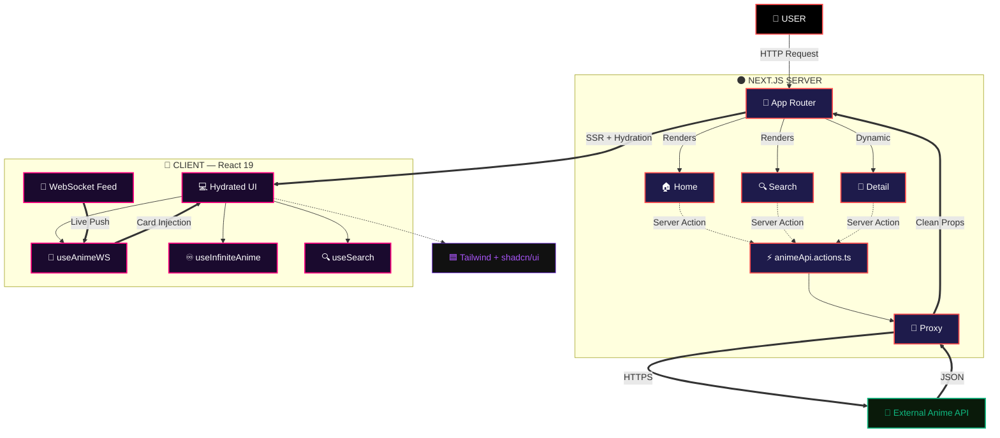
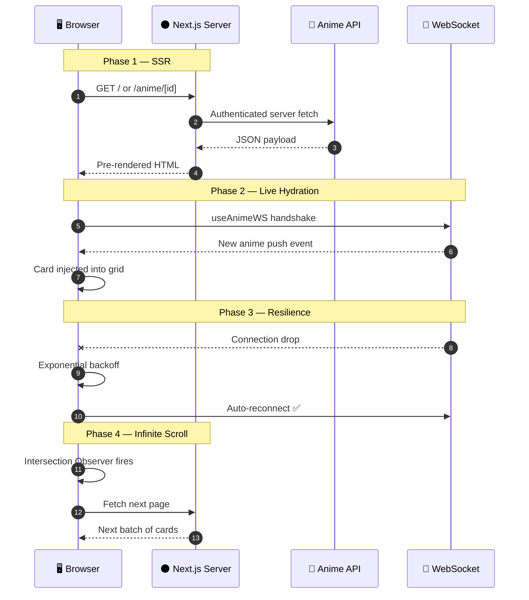

<div align="center">


<br/>

<a href="https://anime-grid-demo.vercel.app">
  
</a>

<br/><br/>


<br/><br/>


<br/>


<br/>


<br/><br/>

> *"A visually stunning, fast, and fully responsive anime discovery grid — built for binge-watchers, collectors, and developers alike."*

<br/>

<a href="https://anime-grid-demo.vercel.app"></a>
&nbsp;
<a href="#9--getting-started"></a>
&nbsp;
<a href="#12--contributing"></a>
&nbsp;
<a href="#6--roadmap"></a>

</div>

---

## 📋 Table of Contents

1. [🌸 Project Overview](#1--project-overview)
2. [✨ Key Features](#2--key-features)
3. [🏗️ Architecture](#3-%EF%B8%8F-architecture)
   - 3.1 [🗂️ Project Structure](#31-%EF%B8%8F-project-structure)
   - 3.2 [📐 System Diagram](#32--system-diagram)
   - 3.3 [🔄 Data Lifecycle](#33--data-lifecycle)
4. [🛠️ Tech Stack](#4-%EF%B8%8F-tech-stack)
5. [📸 Screenshots](#5--screenshots)
6. [🗺️ Roadmap](#6-%EF%B8%8F-roadmap)
7. [⚡ Performance](#7--performance)
8. [🔐 Security](#8--security)
9. [📦 Getting Started](#9--getting-started)
   - 9.1 [🔧 Prerequisites](#91--prerequisites)
   - 9.2 [⬇️ Install](#92-%EF%B8%8F-install)
   - 9.3 [🔑 Environment](#93--environment)
   - 9.4 [🖥️ Run & Build](#94-%EF%B8%8F-run--build)
10. [🚀 Deployment](#10--deployment)
11. [❓ FAQ](#11--faq)
12. [🤝 Contributing](#12--contributing)
13. [📄 Changelog](#13--changelog)
14. [👤 Author](#14--author)
15. [⭐ Show Your Support](#15--show-your-support)

---

## 1. 🌸 Project Overview

**Anime Grid** is a premium open-source anime discovery terminal. It transforms raw catalogue data into a cinematic, glassmorphic browsing experience — fast enough for infinite scrolling, rich enough for deep dives, and responsive from 320px mobile to 4K ultra-wide.

> 🎯 **Built for:** Anime fans, developers, and anyone exploring a world-class Next.js 15 codebase.

| 🔖 | Version | 📦 Highlight |
|:---:|:---:|:---|
| 🆕 | `v2.1` | WebSocket live feed + Glassmorphism v2 + official Dockerfile |
| 🔄 | `v2.0` | Next.js 15 + React 19, Turbopack, Infinite Scroll |
| 📦 | `v1.5` | Live Search, Fuzzy Filters, Anime Detail pages |
| 🎉 | `v1.0` | Initial release — SSR grid on Vercel |

---

## 2. ✨ Key Features

<table>
  <tr><td>🎨</td><td><strong>Neon Dark Theme</strong></td><td>Glassmorphism with red-magenta-violet accents, backdrop-blur panels, and grain overlays</td></tr>
  <tr><td>📱</td><td><strong>Responsive Masonry Grid</strong></td><td>Fluid CSS Grid breakpoints — flawless from 320px to 4K, zero horizontal scroll</td></tr>
  <tr><td>🔍</td><td><strong>Live Search + Filters</strong></td><td>Instant debounced fuzzy search across title, genre, studio, status, and rating</td></tr>
  <tr><td>📡</td><td><strong>WebSocket Live Updates</strong></td><td>Real-time card injection — no page reload, auto-reconnect with exponential backoff</td></tr>
  <tr><td>🔄</td><td><strong>Infinite Scroll</strong></td><td>Intersection Observer lazy-loading — thousands of entries, zero jank</td></tr>
  <tr><td>🖥️</td><td><strong>SSR + Server Actions</strong></td><td>Next.js 15 caching and revalidation — fast FCP, SEO-friendly pre-rendering</td></tr>
  <tr><td>🛡️</td><td><strong>Secure API Proxy</strong></td><td>All external calls server-side — API keys never reach the browser bundle</td></tr>
  <tr><td>🧩</td><td><strong>shadcn/ui Components</strong></td><td>Accessible, tree-shakeable primitives — easy to extend and customise</td></tr>
  <tr><td>♿</td><td><strong>Accessibility First</strong></td><td>ARIA labels, keyboard nav, focus trapping — WCAG 2.1 AA compliant</td></tr>
  <tr><td>🔍</td><td><strong>SEO Optimised</strong></td><td>Open Graph, JSON-LD, semantic headings, <code>next/image</code> for zero CLS</td></tr>
  <tr><td>⚡</td><td><strong>Turbopack Builds</strong></td><td>Production bundles in under 3 seconds</td></tr>
  <tr><td>🌐</td><td><strong>PWA Ready</strong></td><td><code>site.webmanifest</code> included — installable, offline groundwork laid</td></tr>
</table>

---

## 3. 🏗️ Architecture

### 3.1 🗂️ Project Structure

```
🌸 anime-grid/
│
├── 🌑 app/                              # Next.js App Router & Layouts
│   ├── 🎨 components/                   # Reusable UI Components
│   │   ├── 🃏 AnimeCard.tsx             # Card with Smart Recovery System
│   │   ├── 🪟 AnimeModal.tsx            # Detailed view modal
│   │   ├── 🏔️ Hero.tsx                  # Professional landing banner
│   │   ├── 🔝 Navbar.tsx                # Navigation with neon branding
│   │   └── 📊 StatsStrip.tsx            # Dynamic data visualisation bar
│   ├── 🎨 globals.css                   # Global styles & CSS variables
│   ├── 📜 layout.tsx                    # Root layout configuration
│   └── 🏠 page.tsx                      # Main entry point — Anime Grid
│
├── 🛠️ lib/                              # Core Logic & Utilities
│   ├── ⚡ action.ts                      # Server-side actions & fetching
│   ├── 🎬 animations.ts                 # GSAP & Framer Motion configs
│   └── 🗄️ data.ts                       # Local anime database (IDs 1–37+)
│
├── 📁 public/                           # Static Assets
│   ├── 🏷️ logo/                         # Social & brand SVG icons
│   ├── 🖼️ hero-banner.png               # Visual banner asset
│   ├── 🌐 favicon.ico                   # Site icon
│   └── 🚫 placeholder.svg               # Fallback for [SIGNAL_LOST] states
│
├── 📸 screens/                          # Documentation screenshots
│   ├── 🌙 dark.png                      # Dark mode preview
│   ├── 🖥️ home.png                      # Desktop view
│   └── 📱 mobile.png                    # Responsive view
│
├── 🔷 types/                            # TypeScript Interfaces
│   └── 📄 index.ts                      # Shared data models
│
├── ⚙️ next.config.js                    # Next.js & remote pattern config
├── 📦 package.json                      # Dependencies & scripts
└── 🔷 tsconfig.json                     # TypeScript compiler settings
```

### 3.2 📐 System Diagram



### 3.3 🔄 Data Lifecycle



---

## 4. 🛠️ Tech Stack

### 🌑 Core
<p>
  
  
  
  
</p>

### 📡 Data Layer
<p>
  
  
  
  
</p>

### 🎨 Design
<p>
  
  
  
  
</p>

| ⚙️ Capability | 🔬 Implementation | 🏆 Result |
|:---|:---|:---|
| 🔷 Type Safety | TypeScript 5 strict mode | Zero runtime errors |
| ⚡ Build Speed | Turbopack | Sub-3s production build |
| 🔐 API Security | Server-side proxy + env vars | Keys never reach browser |
| 📱 Responsive | Mobile-first CSS Grid | 320px → 4K support |
| ♾️ Scroll | Intersection Observer | 1000+ cards, no jank |
| ♻️ WS Resilience | Exponential backoff | Self-healing live stream |

---

## 5. 📸 Screenshots

<div align="center">

| 🏠 Home — Masonry Grid | 🎌 Anime Detail |
|:---:|:---:|
|  |  |

| 📱 Mobile (320px) | 🌙 Neon Dark Close-Up |
|:---:|:---:|
|  |  |

> 📷 *Live at [anime-grid-demo.vercel.app](https://anime-grid-demo.vercel.app)*

</div>

---

## 6. 🗺️ Roadmap

| Status | 🚀 Feature | 🎯 Priority |
|:---:|:---|:---:|
| ✅ | Masonry Grid + Infinite Scroll | 🔴 Core |
| ✅ | Neon Dark Glassmorphism Theme | 🔴 Core |
| ✅ | WebSocket Live Updates + Auto-Reconnect | 🔴 Core |
| ✅ | Live Search + Multi-Filter Panel | 🔴 Core |
| ✅ | Next.js 15 + React 19 + Turbopack | 🔴 Core |
| 🔄 | **User Collections & Favourites** | 🟡 High |
| 🔄 | **AI Recommendation Engine** | 🟡 High |
| 🔄 | **Light Mode Toggle** | 🟡 High |
| 📅 | **PWA + Offline Support** | 🟢 Planned |
| 📅 | **i18n — Multi-Language** | 🟢 Planned |
| 📅 | **Push Notifications** (new episode alerts) | 🟢 Planned |
| 💡 | **Community Reviews** | 🔵 Idea |

> 💬 Have an idea? [Open a feature request →](https://github.com/salonyranjan/anime-grid/issues/new)

---

## 7. ⚡ Performance

| 📊 Metric | 🎯 Score | 📝 Notes |
|:---|:---:|:---|
| ⚡ Performance | `95+` | Turbopack + code splitting |
| ♿ Accessibility | `93+` | ARIA, keyboard nav |
| 🔍 SEO | `100` | Open Graph + JSON-LD |
| ✅ Best Practices | `96+` | HTTPS, no deprecated APIs |
| 🎨 FCP | `< 1.0s` | SSR pre-render |
| 🖼️ LCP | `< 2.0s` | `next/image` optimised |
| 📐 CLS | `0.00` | Zero layout shift |
| 📡 WS Latency | `< 80ms` | Live feed response |
| 🏗️ Build | `≈ 2.8s` | Turbopack production |

> 💡 Test it: `npm run build && npx serve .next` → [PageSpeed Insights](https://pagespeed.web.dev/)

---

## 8. 🔐 Security

```
┌───────────────────────────────────────────────────────────────┐
│                ANIME GRID — SECURITY LAYERS                   │
├───────────────────────────────────────────────────────────────┤
│  🔐 Layer 1 — API Key Isolation                               │
│     Keys in .env.local (git-ignored), accessed only via       │
│     Server Actions — never bundled into client JS             │
├───────────────────────────────────────────────────────────────┤
│  🛡️ Layer 2 — Server-Side Proxy                               │
│     All external fetches route through lib/proxy.ts           │
│     Responses sanitized before delivery to the client         │
├───────────────────────────────────────────────────────────────┤
│  🔒 Layer 3 — Environment Segregation                         │
│     .env.local for dev · Vercel Env Vars for production       │
│     Zero cross-contamination between environments             │
├───────────────────────────────────────────────────────────────┤
│  🧱 Layer 4 — Secure HTTP Headers                             │
│     CSP · X-Frame-Options: DENY · HSTS via next.config.ts     │
└───────────────────────────────────────────────────────────────┘
```

> ⚠️ **Never commit `.env.local`** — add production secrets via the Vercel dashboard only.

---

## 9. 📦 Getting Started

Get Anime Grid running locally in under **3 minutes**.

### 9.1 🔧 Prerequisites

| 🛠️ Tool | 📌 Version | 🔗 Link |
|:---|:---:|:---|
|  | `≥ 18.x` | [nodejs.org](https://nodejs.org/) |
|  | `≥ 8.x` | Bundled with Node |
|  | any | [git-scm.com](https://git-scm.com/) |
| 🔑 Anime API Key | free tier | [jikan.moe](https://jikan.moe/) · [anilist.co](https://anilist.co/graphql) |

### 9.2 ⬇️ Install

```bash
git clone https://github.com/salonyranjan/anime-grid.git
cd anime-grid
npm install          # or: pnpm install
```

### 9.3 🔑 Environment

```bash
cp .env.example .env.local
```

```env
ANIME_API_BASE_URL=https://api.jikan.moe/v4
ANIME_API_KEY=your_key_if_required
NEXT_PUBLIC_WS_URL=wss://your-ws-server.com/anime-feed
NEXT_PUBLIC_APP_URL=http://localhost:3000
```

### 9.4 🖥️ Run & Build

```bash
# Development (hot reload)
npm run dev
# → http://localhost:3000

# Production build
npm run build && npm start
```

---

## 10. 🚀 Deployment

### ☁️ Vercel — Recommended

```
1. Push repo to GitHub
2. Import at vercel.com/new
3. Add env vars (ANIME_API_BASE_URL, ANIME_API_KEY, NEXT_PUBLIC_WS_URL)
4. Click Deploy ✅  — live in under 60 seconds
```

### 🐳 Docker

```bash
docker build -t anime-grid .
docker run -p 3000:3000 --env-file .env.local anime-grid
```

```dockerfile
FROM node:20-alpine AS builder
WORKDIR /app
COPY package*.json ./
RUN npm ci
COPY . .
RUN npm run build

FROM node:20-alpine AS runner
WORKDIR /app
COPY --from=builder /app/.next ./.next
COPY --from=builder /app/public ./public
COPY --from=builder /app/package*.json ./
ENV NODE_ENV=production
EXPOSE 3000
CMD ["npm", "start"]
```

### ⚙️ Manual

```bash
npm run build
PORT=8080 npm start
```

---

## 11. ❓ FAQ

<details>
<summary><strong>🔐 Why is the API key never in the browser?</strong></summary>
All external API calls go through `lib/animeApi.actions.ts` — a Next.js Server Action. The key lives on the server only; the client receives only sanitized JSON. Open DevTools → Network — you'll see zero key exposure.
</details>

<details>
<summary><strong>🔌 Can I swap in a different anime data source?</strong></summary>
Yes. Update `ANIME_API_BASE_URL` in `.env.local` and adjust the request/response shape in `lib/animeApi.actions.ts` to match your provider — AniList GraphQL, Kitsu REST, or any custom API.
</details>

<details>
<summary><strong>📱 Is it fully mobile-friendly?</strong></summary>
The masonry grid uses mobile-first CSS Grid breakpoints via Tailwind, tested from 320px (iPhone SE) to 2560px desktop. Touch events and swipe gestures work naturally.
</details>

<details>
<summary><strong>🎨 How do I change the neon colors?</strong></summary>
Edit the custom color tokens in `tailwind.config.ts` under `theme.extend.colors`. CSS custom properties cascade through all components — one change, site-wide update.
</details>

<details>
<summary><strong>⚡ Why does the WebSocket feed sometimes lag?</strong></summary>
Free-tier anime APIs have rate limits. For production, use a self-hosted feed or a paid API tier with a dedicated WebSocket endpoint. The built-in exponential backoff handles temporary drops automatically.
</details>

---

## 12. 🤝 Contributing

All contributions are **warmly welcome**! 🌸

```bash
# 1. Fork the repo on GitHub
# 2. Create your branch
git checkout -b feature/your-feature

# 3. Commit with conventional format
git commit -m "feat: add your feature"
# Prefixes: fix: | docs: | style: | refactor: | test: | chore:

# 4. Push & open a PR
git push origin feature/your-feature
```

**Priority areas:**

| 🔥 Area | 📝 What's Needed |
|:---|:---|
| 🤖 AI Recommendations | "You might also like" via LLM or ML model |
| 🎨 UI Variants | New neon palettes, alternative card layouts |
| 📡 WebSocket | Multiplexed subscriptions, back-pressure handling |
| 🧪 Tests | Vitest coverage for Server Actions, hooks, components |
| 📦 PWA | Service worker, offline caching, push alerts |

---

## 13. 📄 Changelog

| Version | Highlights |
|:---|:---|
| 🆕 `v2.1.0` | WebSocket live feed + auto-reconnect · Glassmorphism v2 · Dockerfile |
| `v2.0.0` | Next.js 15 + React 19 · Turbopack · Infinite Scroll · shadcn/ui |
| `v1.5.0` | Anime Detail pages · Trailer embed · Server-side proxy |
| `v1.0.0` | 🎉 Initial release — SSR grid on Vercel |

---

## 14. 👤 Author

<table style="border:none;">
  <tr>
    <td align="center" style="border:none;" width="160">
      
    </td>
    <td style="border:none; padding-left:22px;">
      <h3>✦ Salony Ranjan</h3>
      <p>🧑‍💻 Full-Stack Dev &nbsp;·&nbsp; 🤖 AI Engineer &nbsp;·&nbsp; 🎨 UI/UX & Motion Specialist</p>
      <p><em>"Building beautiful, performant web experiences — one pixel and one commit at a time."</em></p>
      <br/>
      <a href="https://www.linkedin.com/in/salony-ranjan-b63200280/"></a>
      &nbsp;
      <a href="https://github.com/salonyranjan"></a>
      &nbsp;
      <a href="mailto:salonyranjan@gmail.com"></a>
      &nbsp;
      <a href="https://vertex-flow-phi.vercel.app/"></a>
    </td>
  </tr>
</table>

---

## 15. ⭐ Show Your Support

<div align="center">

If Anime Grid helped you discover your next binge, inspired your build, or just looked stunning — show it some love! 🌸

<a href="https://github.com/salonyranjan/anime-grid/stargazers"></a>
&nbsp;
<a href="https://github.com/salonyranjan/anime-grid/fork"></a>
&nbsp;
<a href="https://anime-grid-demo.vercel.app"></a>
&nbsp;
<a href="https://github.com/salonyranjan/anime-grid/issues/new"></a>

<br/><br/>


<br/>

*Made with* ❤️ *by* [**Salony Ranjan**](https://github.com/salonyranjan) &nbsp;·&nbsp; *© 2026 Anime Grid · MIT*


</div>
